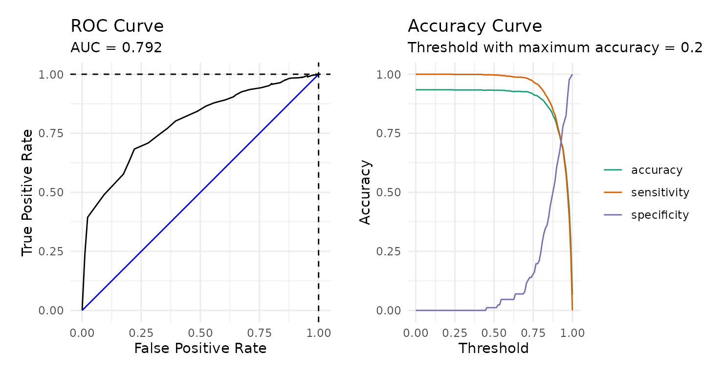
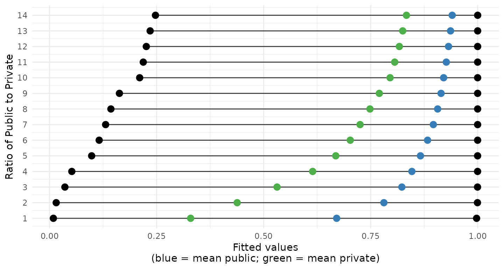
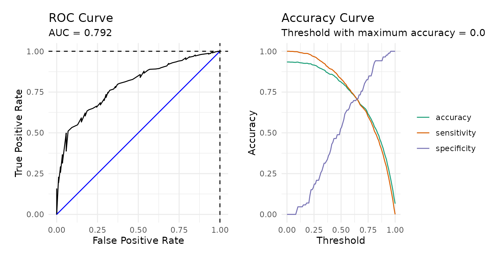

# Downsampling for Predictive Modeling

One of the challenges in predictive modeling occurs when the dependent
variable is imbalanced (i.e. the ratio of one class to the other is
high, generally greater than 80-to-20). Several strategies have been
proposed to address the imbalance including upsampling and downsampling.
Upsampling involves duplicating data from the smaller class to better
match the number of observations from the larger class. The disadvantage
of upsampling is that new data is being created that could potentially
cause overfitting. Additionally, by artificially increasing the sample
size standard errors will also be artificially decreased. Downsampling
involves randomly selecting from the larger class to achieve better
balance. The disadvantage of downsampling is that some data, and
sometimes a lot of data, is excluded from the model.

This paper introduces a procedure that downsamples while using all
available data by training multiple models. For example, consider a
dataset with 1,000 observations, 900 are of class A and 100 are of class
B. Assuming we wish to have perfect balance between A and B, we would
randomly assign the 900 class A observations to one of nine models. We
can then pool the predictions across the nine models.

## Working Example

``` r
library(medley)
data('pisa', package = 'medley')
data('pisa_variables', package = 'medley')
```

The [Programme of International Student
Assessment](https://www.oecd.org/en/about/programmes/pisa.html) (PISA)
is international study conducted by the [Organisation for Economic
Co-operation and Development](https://www.oecd.org/en.html) (OECD) every
three years. It assesses 15-year-old students in mathematics, science,
and reading while collecting information about the students and their
schools. The `pisa` dataset included in the `medley` package comes from
the 2009 administration and is used to demonstrate predicting private
versus public school attendance. There are 5,233 observations across 44
variables with 93.4% public school students and 6.6% private school
students.

To begin, we will split the data into a training and validation set
using the
[`splitstackshape::stratified()`](https://search.r-project.org/CRAN/refmans/splitstackshape/html/stratified.html)
function to ensure that the ratio of public-to-private school students
is the same in both datasets.

``` r
pisa_formu <- Public ~ .
names(pisa) <- pisa_variables[names(pisa)]
pisa_splits <- splitstackshape::stratified(
    pisa, group = "Public", size = 0.75, bothSets = TRUE)
pisa_train <- pisa_splits[[1]] |> as.data.frame()
pisa_valid <- pisa_splits[[2]] |> as.data.frame()
```

``` r
table(pisa$Public, useNA = 'ifany') |> print() |> prop.table()
#> 
#> FALSE  TRUE 
#>   345  4888
#> 
#>      FALSE       TRUE 
#> 0.06592777 0.93407223
table(pisa_train$Public, useNA = 'ifany') |> print() |> prop.table()
#> 
#> FALSE  TRUE 
#>   259  3666
#> 
#>      FALSE       TRUE 
#> 0.06598726 0.93401274
table(pisa_valid$Public, useNA = 'ifany') |> print() |> prop.table()
#> 
#> FALSE  TRUE 
#>    86  1222
#> 
#>      FALSE       TRUE 
#> 0.06574924 0.93425076
```

We can estimate a logistic regression model and get the predicted
probabilities for the validation dataset.

``` r
pisa_lr_out <- glm(pisa_formu, data = pisa_train, family = binomial(link = 'logit'))
pisa_predictions <- predict(pisa_lr_out, newdata = pisa_valid, type = 'response')
```

The figure below shows the distribution of predicted probabilities for
the validation dataset. There is some separation between public and
private school students, but the densities are clearly centered to the
right side of the range.

``` r
ggplot(data.frame(Public = pisa_valid$Public, 
                  Prediction = pisa_predictions), 
       aes(x = Prediction, color = Public)) +
  geom_density()
```


The figure below provides a receiver operator characteristic (ROC) curve
along with a plot of the accuracy, sensitivity, and specificity.

``` r
calculate_roc(predictions = pisa_predictions, 
              observed = pisa_valid$Public) |> plot()
```



The confusion matrix below, splitting at 0.5, indicates that this model
is no better than the null model (i.e percent public school students is
93.4%). Of course we could adjust that cut value to optimize either the
*specificity* or *sensitivity*.

``` r
confusion_matrix(observed = pisa_valid$Public, 
                 predicted = pisa_predictions > 0.5)
#>            predicted              
#>   observed     FALSE          TRUE
#>      FALSE 1 (0.08%)    85 (6.50%)
#>       TRUE 4 (0.31%) 1218 (93.12%)
#> Accuracy: 93.2%
#> Sensitivity: 1.16%
#> Specificity: 99.67%
```

## Shrinking Fitted Values

It turns out that the range of fitted values from logistic regression
will shrink as the amount of imbalance in the dependent variable
increases. I first encountered this issue when estimating propensity
scores for [my
dissertation](https://github.com/jbryer/dissertation?tab=readme-ov-file)
in a study of charter versus traditional public school students. In that
study using the [National Assessment of Educational
Progress](https://nces.ed.gov/nationsreportcard/) (NAEP) approximately
3% of students attended a charter school. In that study, the range of
propensity scores were severely constrained. To explore why, the
[multilevel::psrange()](https://jbryer.github.io/multilevelPSA/reference/psrange.html)
function was developed The result of this function is the figure below.
Starting at the bottom, 345 public school students were randomly
selected so that the logistic regression could be estimated where there
is perfect balance in the dependent variable. As we move up we increase
the ratio from 1:1 to 1:13. For each ratio, 20 random samples are drawn,
logistic regression model estimated, and the minimum and maximum fitted
values (i.e. predicted probabilities) are recorded (they are represented
by the black dots and green bars). The distributions across all models
are also included.


Plotting just the ranges along with the mean of the fitted values for
public (blue) and private (green) school students shows that once the
ratio is greater than 3-to-1 the mean of the fitted values for the zero
class (private schools in this example) is greater than 0.5.



## Downsampling

As discussed above one of the key disadvantages of downsampling is that
in situations where there is significant imbalance we are excluding a
lot of data from analysis. The
[`downsample()`](../reference/downsample.md) function will first
determine how many models need to be estimated such that each
observation from the larger class is used exactly once. For this example
we are using a public-to-private student ratio of 2-to-1 so that for
each model estimated there are 259 private and 518 public student
observations. Given there are 3925 observations in our training set, the
`dowmsample()` function will estimate 7 models.

``` r
pisa_ds_out <- downsample(
  formu = pisa_formu,
  data = pisa_train,
  model_fun = glm,
  ratio = 2,
  family = binomial(link = 'logit'),
  show_progress = FALSE)
```

``` r
length(pisa_ds_out)
#> [1] 7
```

We can use the [`predict()`](https://rdrr.io/r/stats/predict.html)
function to get a data frame of predictions. Each column corresponds to
the predicted value for each of the 7 models.

``` r
pisa_predictions_ds <- predict(pisa_ds_out,
                               newdata = pisa_valid, 
                               type = 'response')
head(pisa_predictions_ds)
#>      model1    model2    model3    model4    model5    model6    model7
#> 1 0.8511828 0.7437341 0.8921605 0.8424369 0.7347052 0.8697531 0.6928875
#> 2 0.7393116 0.6822714 0.9466815 0.7959953 0.8118642 0.9441840 0.9580830
#> 3 0.4944206 0.3813138 0.5575741 0.3586561 0.5023435 0.5805062 0.6281852
#> 4 0.8525691 0.8268514 0.8293386 0.8372777 0.9464037 0.8843848 0.9016058
#> 5 0.1823382 0.3670335 0.4556063 0.1408078 0.1899378 0.3578418 0.2657968
#> 6 0.9216160 0.8192096 0.9040353 0.9213184 0.8080822 0.9076342 0.8768295
```

We can average the predictions to get a single vector.

``` r
pisa_predictions_ds2 <- pisa_predictions_ds |> apply(1, mean)
```

The density distributions are provided below. These distributions are
more like the distributions we expect when we have balanced data even
though we did use all the observations to get these predicted
probabilities.

``` r
ggplot(data.frame(Public = pisa_valid$Public, 
                  Prediction = pisa_predictions_ds2), 
       aes(x = Prediction, color = Public)) +
  geom_density()
```


Although the [`downsample()`](../reference/downsample.md) function
appears to address the issue of shrinking and off centered fitted
values, the model performance metrics provided below suggest that it did
not improve the overall performance of the model predictions.

``` r
roc <- calculate_roc(predictions = pisa_predictions_ds2, 
                     observed = pisa_valid$Public)
plot(roc)
```



``` r
confusion_matrix(observed = pisa_valid$Public, 
                 predicted = pisa_predictions_ds2 > 0.5)
#>               predicted              
#>   observed        FALSE          TRUE
#>      FALSE   45 (3.44%)    41 (3.13%)
#>       TRUE 204 (15.60%) 1018 (77.83%)
#> Accuracy: 81.27%
#> Sensitivity: 52.33%
#> Specificity: 83.31%
```

## Appendix A: Model Summaries

Above we averaged the predicted values across all the models to get a
single prediction for each observation in our validation dataset.
However, it is possible to pool models using the
[`mice::pool()`](https://amices.org/mice/reference/pool.html) function
to get a single set of regression coefficients. The table below provides
the pooled regression coefficients from the `downsample` function along
with the coefficients from the logistic regression model using all the
data.

|                                                                 | Pooled from downsamples |         Complete data |
|-----------------------------------------------------------------|------------------------:|----------------------:|
| (Intercept)                                                     |        5.516 \* (2.376) |  7.862 \*\*\* (1.657) |
| SexMale                                                         |     -0.823 \*\* (0.244) | -0.762 \*\*\* (0.149) |
| \`Attend \<ISCED 0\>\`Yes, one year or less                     |           0.495 (0.286) |    0.498 \*\* (0.190) |
| \`Age at \<ISCED 1\>\`                                          |           0.087 (0.186) |         0.075 (0.104) |
| \`Repeat \<ISCED 1\>\`Yes, once                                 |           0.693 (0.548) |         0.645 (0.345) |
| \`At Home - Mother\`TRUE                                        |          -0.888 (0.843) |        -0.921 (0.493) |
| \`At Home - Father\`TRUE                                        |          -0.672 (0.414) |     -0.620 \* (0.277) |
| \`At Home - Brothers\`TRUE                                      |           0.184 (0.313) |         0.155 (0.146) |
| \`At Home - Sisters\`TRUE                                       |        0.563 \* (0.237) |    0.454 \*\* (0.146) |
| \`At Home - Grandparents\`TRUE                                  |       -0.725 \* (0.328) |   -0.648 \*\* (0.201) |
| \`At Home - Others\`TRUE                                        |          -0.094 (0.332) |        -0.136 (0.221) |
| \`Mother \<Highest Schooling\>\`\<ISCED level 3A\>              |           0.101 (0.631) |         0.070 (0.388) |
| \`Mother Current Job Status\`Other                              |          -0.457 (0.609) |        -0.303 (0.364) |
| \`Mother Current Job Status\`Working Full-time                  |          -0.608 (0.537) |        -0.443 (0.339) |
| \`Mother Current Job Status\`Working Part-Time                  |          -0.586 (0.650) |        -0.446 (0.369) |
| \`Father \<Highest Schooling\>\`\<ISCED level 2\>               |           0.072 (1.219) |         0.077 (0.832) |
| \`Father \<Highest Schooling\>\`\<ISCED level 3A\>              |          -0.579 (1.121) |        -0.658 (0.754) |
| \`Father Current Job Status\`Other                              |          -0.019 (0.737) |        -0.065 (0.394) |
| \`Father Current Job Status\`Working Full-time                  |           0.356 (0.604) |         0.236 (0.324) |
| \`Father Current Job Status\`Working Part-Time                  |           1.260 (0.892) |         0.998 (0.529) |
| \`Language at home\`Language of test                            |           0.137 (0.489) |        -0.104 (0.263) |
| \`Possessions desk\`TRUE                                        |          -0.583 (0.404) |     -0.531 \* (0.265) |
| \`Possessions own room\`TRUE                                    |           0.521 (0.384) |      0.600 \* (0.238) |
| \`Possessions study place\`TRUE                                 |          -0.056 (0.488) |        -0.223 (0.303) |
| \`Possessions computer\`TRUE                                    |          -0.077 (0.855) |        -0.038 (0.592) |
| \`Possessions software\`TRUE                                    |           0.365 (0.332) |      0.358 \* (0.161) |
| \`Possessions Internet\`TRUE                                    |          -1.416 (0.917) |        -1.177 (0.602) |
| \`Possessions literature\`TRUE                                  |       -0.619 \* (0.295) |   -0.551 \*\* (0.175) |
| \`Possessions poetry\`TRUE                                      |          -0.369 (0.308) |        -0.250 (0.176) |
| \`Possessions art\`TRUE                                         |          -0.402 (0.333) |        -0.273 (0.196) |
| \`Possessions textbooks\`TRUE                                   |          -0.021 (0.356) |        -0.007 (0.214) |
| \`Possessions dictionary\`TRUE                                  |           0.100 (0.583) |        -0.000 (0.422) |
| \`Possessions dishwasher\`TRUE                                  |          -0.074 (0.336) |        -0.078 (0.234) |
| \`How many cellular phones\`Three or more                       |          -0.851 (0.987) |        -0.906 (0.741) |
| \`How many cellular phones\`Two                                 |          -0.192 (0.985) |        -0.478 (0.771) |
| \`How many televisions\`Three or more                           |        1.378 \* (0.645) |  0.995 \*\*\* (0.302) |
| \`How many televisions\`Two                                     |           0.816 (0.640) |         0.519 (0.324) |
| \`How many computers\`One                                       |           0.589 (1.188) |         0.343 (0.823) |
| \`How many computers\`Three or more                             |           0.174 (1.168) |        -0.072 (0.838) |
| \`How many computers\`Two                                       |           0.079 (1.143) |        -0.120 (0.832) |
| \`How many cars\`Three or more                                  |           0.038 (0.458) |        -0.041 (0.295) |
| \`How many cars\`Two                                            |          -0.223 (0.427) |        -0.264 (0.291) |
| \`How many rooms bath or shower\`Three or more                  |       -1.001 \* (0.427) |   -0.703 \*\* (0.238) |
| \`How many rooms bath or shower\`Two                            |          -0.223 (0.371) |        -0.107 (0.217) |
| \`How many books at home\`101-200 books                         |          -0.255 (0.440) |        -0.367 (0.327) |
| \`How many books at home\`11-25 books                           |          -0.158 (0.431) |        -0.158 (0.339) |
| \`How many books at home\`201-500 books                         |       -0.998 \* (0.477) |   -0.985 \*\* (0.334) |
| \`How many books at home\`26-100 books                          |          -0.498 (0.395) |        -0.489 (0.302) |
| \`How many books at home\`More than 500 books                   |          -1.082 (0.558) |   -1.042 \*\* (0.366) |
| \`Reading Enjoyment Time\`30 minutes or less a day              |          -0.071 (0.477) |        -0.183 (0.251) |
| \`Reading Enjoyment Time\`Between 30 and 60 minutes             |           0.494 (0.457) |         0.311 (0.283) |
| \`Reading Enjoyment Time\`I don't read for enjoyment            |          -0.019 (0.466) |        -0.118 (0.259) |
| \`Reading Enjoyment Time\`More than 2 hours a day               |           0.245 (0.747) |         0.208 (0.406) |
| \`\<Enrich\> in \<test lang\>\`TRUE                             |          -0.012 (0.671) |         0.242 (0.413) |
| \`\<Enrich\> in \<mathematics\>\`TRUE                           |          -0.236 (0.569) |        -0.276 (0.323) |
| \`\<Enrich\> in \<science\>\`TRUE                               |           0.576 (0.634) |         0.367 (0.410) |
| \`\<Remedial\> in \<test lang\>\`TRUE                           |           0.311 (0.964) |         0.041 (0.524) |
| \`\<Remedial\> in \<mathematics\>\`TRUE                         |          -0.511 (0.685) |        -0.614 (0.384) |
| \`\<Remedial\> in \<science\>\`TRUE                             |          -0.197 (0.789) |         0.245 (0.496) |
| \`Out of school lessons \<test lang\>\`Do not attend            |          -0.279 (0.815) |        -0.106 (0.493) |
| \`Out of school lessons \<test lang\>\`Less than 2 hours a week |          -0.685 (0.712) |        -0.533 (0.465) |
| \`Out of school lessons \<maths\>\`4 up to 6 hours per week     |           0.237 (0.902) |         0.386 (0.541) |
| \`Out of school lessons \<maths\>\`Do not attend                |          -0.254 (0.798) |        -0.160 (0.410) |
| \`Out of school lessons \<maths\>\`Less than 2 hours a week     |          -0.117 (0.618) |         0.122 (0.369) |
| \`Out of school lessons \<science\>\`4 up to 6 hours per week   |          -1.091 (0.789) |        -0.837 (0.549) |
| \`Out of school lessons \<science\>\`Do not attend              |          -0.565 (0.717) |        -0.456 (0.472) |
| \`Out of school lessons \<science\>\`Less than 2 hours a week   |          -0.534 (0.751) |        -0.513 (0.464) |
| n                                                               |                783      |             3925.000  |
| \*\*\* p \< 0.001; \*\* p \< 0.01; \* p \< 0.05.                |                         |                       |

## Appendix B: Random Forest

The [`downsample()`](../reference/downsample.md) function can use nearly
any modeling function available in R. In this appendix we show how to
use random forest. In order to use classification with
[`randomForest()`](https://rdrr.io/pkg/randomForest/man/randomForest.html)
we must convert our dependent varaible to a factor.

``` r
library(randomForest)
data('pisa', package = 'medley')
data('pisa_variables', package = 'medley')
pisa$Public <- factor(pisa$Public)
pisa_splits <- splitstackshape::stratified(
    pisa, group = "Public", size = 0.75, bothSets = TRUE)
pisa_train <- pisa_splits[[1]] |> as.data.frame()
pisa_valid <- pisa_splits[[2]] |> as.data.frame()
```

Setting `model_fun = randomForest` will estimate random forest models
for each of the models.

``` r
pisa_ds_out_rf <- downsample(
  formu = pisa_formu,
  data = pisa_train,
  model_fun = randomForest,
  ratio = 2,
  show_progress = FALSE)
```

``` r
length(pisa_ds_out_rf)
#> [1] 7

pisa_predictions_ds_rf <- predict(pisa_ds_out_rf,
                                  newdata = pisa_valid, 
                                  type = 'response')
head(pisa_predictions_ds_rf)
#>   model1 model2 model3 model4 model5 model6 model7
#> 1   TRUE   TRUE   TRUE   TRUE   TRUE   TRUE   TRUE
#> 2  FALSE   TRUE   TRUE   TRUE   TRUE   TRUE   TRUE
#> 3   TRUE   TRUE  FALSE   TRUE   TRUE   TRUE   TRUE
#> 4  FALSE   TRUE  FALSE  FALSE  FALSE  FALSE   TRUE
#> 5   TRUE   TRUE   TRUE   TRUE   TRUE   TRUE   TRUE
#> 6  FALSE  FALSE   TRUE  FALSE  FALSE  FALSE  FALSE
```

Random forest returns the predicted class when `type = 'response'`.
There are several ways we can handle this. Here we use a simple voting
strategy.

``` r
pisa_predictions_ds_rf_vote <- apply(
    pisa_predictions_ds_rf, 1, 
    FUN = function(x) { mean(as.logical(x)) > 0.5})
confusion_matrix(observed = pisa_valid$Public, 
                 predicted = pisa_predictions_ds_rf_vote)
#>               predicted              
#>   observed        FALSE          TRUE
#>      FALSE   37 (2.83%)    49 (3.75%)
#>       TRUE 143 (10.93%) 1079 (82.49%)
#> Accuracy: 85.32%
#> Sensitivity: 43.02%
#> Specificity: 88.3%
```
