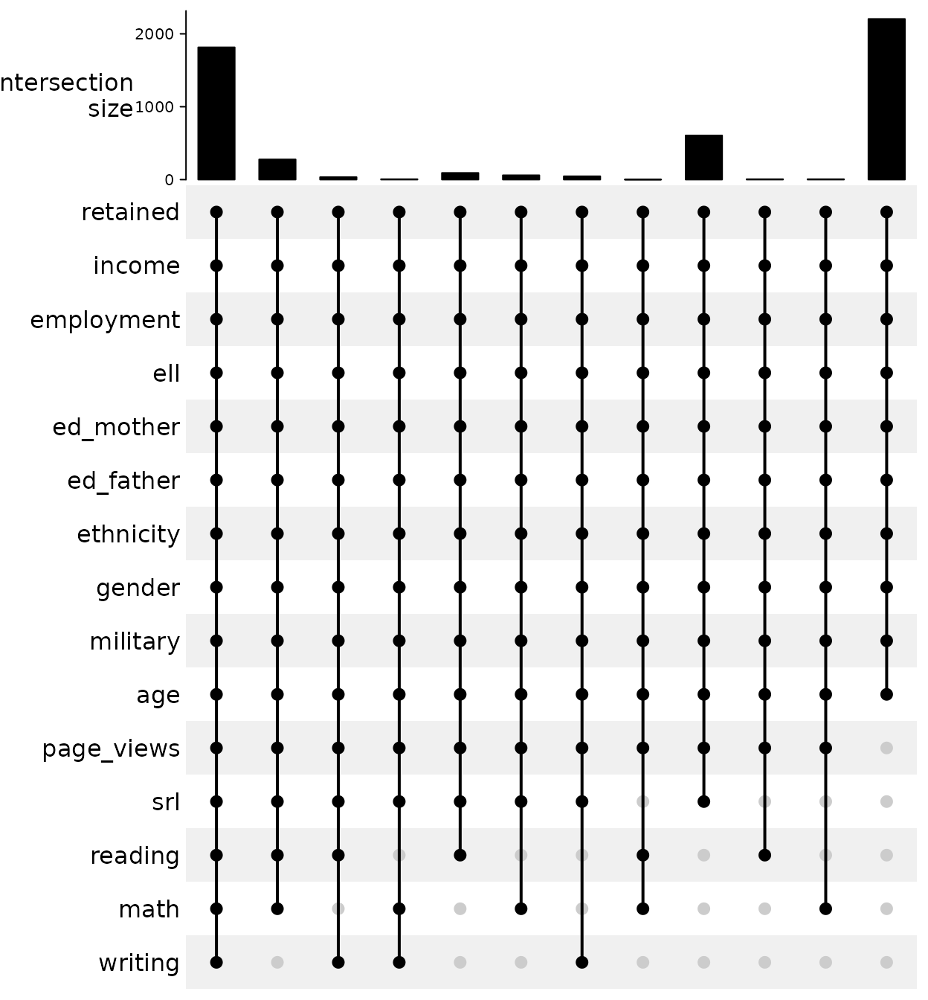

# medley: Predictive Modeling with Missing Data

## Introduction

Most predictive modeling strategies require complete data to train and
predict outcomes. A common strategy is to impute the missing data before
training the models. However, in many situations, missing data occurs
systematically which violates the missing completely at random (MCAR)
assumption. For instance, data may be collected over multiple time
periods or the available data may vary depending on varying collection
protocols or selection bias at the individual level. The `medley`
package provides a framework for estimating predictive model that takes
into account the patterns of missing data.

The motivating example for this approach predictive modeling comes from
predicting student success in college. Institutions have become
increasingly interested in using predictive models to identify students
at risk for attrition as early as possible in order to provided targeted
interventions and supports. Information about students is collected over
several months beginning at the college application phase, commitment to
enroll, orientation, and finally behavior data as the student begins
coursework. In addition to missing data being related to where the
student is in the process, students may opt to not provide certain data
elements. This results in a complex system where a single predictive
model is appropriate.

## Strategy for Predictive Modeling with Missing Data

Consider a data frame with eight observations of five variables as
represented in Figure @ref(fig:framework-data). Rows 3, 7, and 8 have no
missing data; row 1 is missing a value for variable 3; rows 2 and 5 are
missing values in variables 2 and 3; and rows 4 and 6 are missing values
in variables 3, 4, and 5.


Sample data frame with missing data.

The first step of the `medley` algorithm is to determine the pattern of
missingness. If we convert the data frame to a shadow matrix where zero
indicates a missing value and one indicates the value is observed, we
can compute the distribution of the number of observations for each
combination of observed and missing values. Figure
@ref(fig:framework-upset) is an upset plot (Gu, Eils, and Schlesner
2016) where the dots indicate that the corresponding variable was
observed and the bars the size of that set. In this example, there are
three observations where there is no missingness; one row where variable
3 is missing; two observations where variables 2 and 3 are missing; and
two observations where variables 3, 4, and 5 are missing.


Upset plot representing the pattern of missingness.

Since we need at least two observations to train a predictive model, the
maximum number of models we can train is three, as represented in Figure
@ref(fig:framework-models). Note that for observation 1 which was
missing variable 3 is included in the model 2 since that is the next
model that includes the most variables. One of the important parameters
to the `medley` algorithm is the minimum sample size for a model to be
considered. The default is 10% of the total sample size, however for
very large data sets it may be more appropriate to set this parameter to
a specific *n*.


Data frame organized by predictive model.

The order of models is important for both training and predicting since
observations will be assigned to a model with the most number of
variables observed. For example, when making a prediction for an
observation where variable 2 is missing, model 2 would be used. For an
observation that is missing variable 5, model 3 would be used since that
is the only model trained without variable 5 as a dependent variable.

## Data Source

The Diagnostic Assessment and Achievement of College Skills (DAACS;
<https://daacs.net>). DAACS is a suite of technological and social
supports designed to optimize student learning. Students complete
assessments in self-regulated learning, writing, mathematics, and
reading and upon completion receive immediate feedback in terms of
developing, emerging, and mastering. The feedback is tailored to their
results. The data for this paper was part of a larger randomized control
trial where DAACS was embedded within orientation for the treatment
students. Although students were instructed that orientation was
required, there were no consequences for not completing orientation and
therefore approximately 43% of students did not attempt orientation, and
therefore did not complete any DAACS assessments. One of the primary
research goals of the original study was whether the addition of DAACS
data would increase the accuracy of prediction term-to-term retention
(the `retained` variable). Table @ref(tab:descriptives) for descriptive
statistics which reveals that the DAACS results are not complete for
some students. The overall retention base rate is 56.17%.

| Variable                    | N    | Mean | Std Dev | Median |
|:----------------------------|:-----|:-----|:--------|:-------|
| retained                    | 5154 |      |         |        |
| … No                        | 2259 | 44%  |         |        |
| … Yes                       | 2895 | 56%  |         |        |
| page_views                  |      | 39   | 24      | 34     |
| srl                         |      | 2.8  | 0.43    | 2.8    |
| math                        |      | 0.58 | 0.2     | 0.61   |
| reading                     |      | 0.85 | 0.17    | 0.89   |
| writing                     |      | 0.78 | 0.16    | 0.83   |
| income                      |      | 4.4  | 2.4     | 4      |
| employment                  |      | 2.6  | 0.75    | 3      |
| ell                         |      | 0.93 | 0.26    | 1      |
| ed_mother                   |      | 3.3  | 2       | 3      |
| ed_father                   |      | 3.2  | 2       | 3      |
| ethnicity                   | 5154 |      |         |        |
| … Black or African American | 1049 | 20%  |         |        |
| … Hispanic                  | 699  | 14%  |         |        |
| … Other                     | 548  | 11%  |         |        |
| … White                     | 2858 | 55%  |         |        |
| gender                      | 5154 |      |         |        |
| … FEMALE                    | 2123 | 41%  |         |        |
| … MALE                      | 3031 | 59%  |         |        |
| military                    | 5154 |      |         |        |
| … No                        | 2881 | 56%  |         |        |
| … Yes                       | 2273 | 44%  |         |        |
| age                         |      | 35   | 9.3     | 34     |

Descriptive Statistics

### Missing Data Patterns

To begin we first explore the patterns of missing data. Figure
@ref(fig:upset) is an UpSet plot (Gu, Eils, and Schlesner 2016) created
from a shadow matrix[¹](#fn1). Each vertical line corresponds to a set,
or combination, of variables. The dots indicate that that variable is
included in the set. The bars on the top correspond to the number of
observations in that set and the bars to the right correspond to the
total number of observed values. The largest set includes only the
demographics variables, the second largest included demographics and all
DAACS variables. There is a third set that includes self-regulated
learning along with demographics that is worth considering since it
contains more than 10% of the observations. It should be noted that
there is a potential fourth set which included demographic variables
along with three of DAACS variables (SRL, reading, and math). However,
since this set has fewer than 10% of the observations we will use a
three set/model solution.

``` r
shadow_matrix <- as.data.frame(!is.na(daacs))
ComplexHeatmap::make_comb_mat(shadow_matrix) |> ComplexHeatmap::UpSet(right_annotation = NULL)
```



UpSet plot of the missing data

### Data Preparation

To perform the predictive modeling we will split the data into training
(70%) and validation (30%) data sets.

``` r
set.seed(2112); train_rows <- sample(nrow(daacs), nrow(daacs) * 0.7)
daacs_train <- daacs[train_rows,]
daacs_valid <- daacs[-train_rows,]
```

## Baseline Models

There are generally two choices when estimating models when there is
missing data: 1) Model using only the available data or 2) Impute the
missing data before modeling.

### Using available data

In the DAACS data set as depicted in Figure @ref(fig:upset) the
demographics variables were observed for all students. To start we train
a logistic regression model on the training data.

``` r
lr_out <- glm(data = daacs_train,
              formula = retained ~ income + employment + ell + ed_mother + ed_father +
                ethnicity + gender + military + age,
              family = binomial(link = 'logit'))
rf_out <- randomForest(formula = factor(retained) ~ income + employment + ell + ed_mother + ed_father +
                         ethnicity + gender + military + age,
                       data = daacs_train)
```

We can get predicted values from the validation data set and print the
confusion matrix.

``` r
lr_predictions <- predict(lr_out, newdata = daacs_valid, type = 'response')
confusion_matrix(observed = daacs_valid$retained,
                 predicted = lr_predictions > 0.5)
#>               predicted             
#>   observed        FALSE         TRUE
#>      FALSE 295 (19.07%) 386 (24.95%)
#>       TRUE 216 (13.96%) 650 (42.02%)
#> Accuracy: 61.09%
#> Sensitivity: 43.32%
#> Specificity: 75.06%

rf_predictions <- predict(rf_out, newdata = daacs_valid, type = 'response')
confusion_matrix(observed = daacs_valid$retained,
                 predicted = rf_predictions)
#>               predicted             
#>   observed        FALSE         TRUE
#>      FALSE 279 (18.03%) 402 (25.99%)
#>       TRUE 251 (16.22%) 615 (39.75%)
#> Accuracy: 57.79%
#> Sensitivity: 40.97%
#> Specificity: 71.02%
```

The overall accuracy using only the demographic variables is 61.09%

Note that for random forests we used `type = 'response'` which provides
the predicted class. If you wish to get predicted probabilities instead
use `type = 'prob'` (also random forest returns a two column of
predicted values, column 2 corresponds to the predicted probability of
the “success” class). This is useful if you wish to plot a receiver
operating characteristic (ROC) curve as shown in the figure below.

``` r
calculate_roc(
    predictions = predict(rf_out, newdata = daacs_valid, type = 'prob')[,2],
    observed = daacs_valid$retained
) |> plot()
```


### Mean Imputation

``` r
daacs_complete_mean <- daacs
for(i in 2:ncol(daacs_complete_mean)) {
    missing_rows <- is.na(daacs_complete_mean[,i])
    if(sum(missing_rows) > 0) {
        daacs_complete_mean[missing_rows, i] <- mean(daacs_complete_mean[,i], na.rm = TRUE)
    }
}
```

``` r
daacs_train_complete_mean <- daacs_complete_mean[train_rows,]
daacs_valid_complete_mean <- daacs_complete_mean[-train_rows,]

mean_lr_out <- glm(formula = retained ~ .,
                   data = daacs_train_complete_mean,
                   family = binomial(link = logit))
mean_lr_predictions <- predict(mean_lr_out, newdata = daacs_valid_complete_mean, type = 'response')
confusion_matrix(observed = daacs_valid_complete_mean$retained,
                 predicted = mean_lr_predictions > 0.5)
#>               predicted             
#>   observed        FALSE         TRUE
#>      FALSE 292 (18.88%) 389 (25.15%)
#>       TRUE 212 (13.70%) 654 (42.28%)
#> Accuracy: 61.15%
#> Sensitivity: 42.88%
#> Specificity: 75.52%

mean_rf_out <- randomForest(formula = factor(retained) ~ .,
                            data = daacs_train_complete_mean)
mean_rf_predictions <- predict(mean_rf_out, newdata = daacs_valid_complete_mean, type = 'response')
confusion_matrix(observed = daacs_valid_complete_mean$retained,
                 predicted = mean_rf_predictions)
#>               predicted             
#>   observed        FALSE         TRUE
#>      FALSE 316 (20.43%) 365 (23.59%)
#>       TRUE 178 (11.51%) 688 (44.47%)
#> Accuracy: 64.9%
#> Sensitivity: 46.4%
#> Specificity: 79.45%
```

### Multiple imputation

Another common approach to modeling with missing data is multiple
imputation. The `mice` package (Multivariate Imputations by Chained
Equations) is a robust and popular approach to imputing missing data.
For simplicity we will use the final imputed data set for
comparison[²](#fn2).

``` r
mice_out <- mice::mice(daacs[,-1], M = 5, seed = 2112, printFlag = FALSE)
daacs_complete_mice <- cbind(retained = daacs$retained, mice::complete(mice_out))

daacs_train_complete_mice <- daacs_complete_mice[train_rows,]
daacs_valid_complete_mice <- daacs_complete_mice[-train_rows,]
```

With the missing DAACS data imputed we can train a logistic regression
model using the full data set.

``` r
mice_lr_out <- glm(formula = retained ~ .,
                   data = daacs_train_complete_mice,
                   family = binomial(link = logit))
mice_lr_predictions <- predict(mice_lr_out, newdata = daacs_valid_complete_mice, type = 'response')
confusion_matrix(observed = daacs_valid_complete_mice$retained,
                 predicted = mice_lr_predictions > 0.5)
#>               predicted             
#>   observed        FALSE         TRUE
#>      FALSE 297 (19.20%) 384 (24.82%)
#>       TRUE 213 (13.77%) 653 (42.21%)
#> Accuracy: 61.41%
#> Sensitivity: 43.61%
#> Specificity: 75.4%

mice_rf_out <- randomForest(formula = factor(retained) ~ .,
                            data = daacs_train_complete_mice)
mice_rf_predictions <- predict(mice_rf_out, newdata = daacs_valid_complete_mice, type = 'response')
confusion_matrix(observed = daacs_valid_complete_mice$retained,
                 predicted = mice_rf_predictions)
#>               predicted             
#>   observed        FALSE         TRUE
#>      FALSE 278 (17.97%) 403 (26.05%)
#>       TRUE 207 (13.38%) 659 (42.60%)
#> Accuracy: 60.57%
#> Sensitivity: 40.82%
#> Specificity: 76.1%
```

The overall accuracy using only imputed data set is 61.41%

## Medley models

The `medley` function implements a step wise approach to training
models. The `data` and `formula` parameters specify the data set and
full model (i.e. all possible predictor variables to be considered),
similar to other modeling functions in R. The `method` parameter
indicates what model procedure should be used. In this example we will
estimate logistic regression models. The `medley` can take any
additional parameters that need to be passed to the `method` function.

``` r
medley_lr_out <- medley(data = daacs_train,
                              formula = retained ~ .,
                              method = glm,
                              family = binomial(link = logit))
```

    #> Warning in predict.medley(medley_lr_out, newdata = daacs_valid, type =
    #> "response"): Predictions will be returned from the first model only.

Table @ref(tab:model-summaries) provides the baseline retention rate by
model along with the number of observations and formula for each of the
models. Before exploring the specific of the modeling this reveals that
the pattern of missing data is predictive of success. Students who
complete all four DAACS assessments are % more likely to be retained
then students who did not complete any of the assessments.

| Model |    n | Success | Formula                                                                                                                                          |
|------:|-----:|--------:|:-------------------------------------------------------------------------------------------------------------------------------------------------|
|     1 | 1268 |   70.98 | retained ~ page_views + srl + math + reading + writing + income + employment + ell + ed_mother + ed_father + ethnicity + gender + military + age |
|     2 |  788 |   58.25 | retained ~ page_views + srl + income + employment + ell + ed_mother + ed_father + ethnicity + gender + military + age                            |
|     3 | 1551 |   43.20 | retained ~ income + employment + ell + ed_mother + ed_father + ethnicity + gender + military + age                                               |

Baseline retention rate by model

The object returned by `medley` contains the following elements:

- `n_models` - The number of models estimated.
- `formulas` - A list of the formulas used for each model.
- `models` - A list containing the model output for each model. In this
  example this would contain the results of the `glm` function call.
- `data` - The full data set used to train the models.
- `model_observations` - A data frame indicating which models each
  observation was used in. The rows correspond to the rows in `data` and
  the columns correspond to the model.

By default the algorithm will use all sets that have at least 10% of the
total observations (see @ref(tab:model-summaries)). This can be adjusted
using the `min_set_size` parameter (see the
[`get_variable_sets()`](../reference/get_variable_sets.md) function).
Optionally you can specify the models directly by passing a list of
formulas with the `var_sets` parameter.

Table @ref(tab:modelresults) provides the model summaries for the 3
models estimated.

|                                                  |        \(1\) |         |        \(2\) |         |         \(3\) |         |
|--------------------------------------------------|-------------:|--------:|-------------:|--------:|--------------:|--------:|
| (Intercept)                                      |    0.290     | (0.742) |    0.170     | (0.751) |    -0.245     | (0.376) |
| page_views                                       |   -0.004     | (0.003) |   -0.002     | (0.004) |               |         |
| srl                                              |   -0.132     | (0.159) |   -0.190     | (0.180) |               |         |
| math                                             |    0.429     | (0.382) |              |         |               |         |
| reading                                          |   -0.474     | (0.464) |              |         |               |         |
| writing                                          |    0.153     | (0.425) |              |         |               |         |
| income                                           |   -0.003     | (0.029) |    0.046     | (0.035) |    0.062 \*   | (0.025) |
| employment                                       |    0.152     | (0.087) |   -0.190     | (0.104) |    -0.047     | (0.072) |
| ell                                              |    0.034     | (0.268) |    0.436     | (0.318) |     0.311     | (0.210) |
| ed_mother                                        |    0.056     | (0.045) |   -0.001     | (0.053) |    -0.036     | (0.037) |
| ed_father                                        |    0.011     | (0.044) |    0.093     | (0.052) |     0.024     | (0.036) |
| ethnicityHispanic                                |   -0.241     | (0.251) |    0.438     | (0.264) |     0.123     | (0.186) |
| ethnicityOther                                   |   -0.015     | (0.265) |    0.212     | (0.284) |     0.250     | (0.201) |
| ethnicityWhite                                   |    0.053     | (0.198) |    0.348     | (0.194) |     0.069     | (0.134) |
| genderMALE                                       |    0.179     | (0.146) |   -0.048     | (0.173) |    0.280 \*   | (0.120) |
| militaryTRUE                                     | 0.869 \*\*\* | (0.155) | 0.643 \*\*\* | (0.178) |  0.721 \*\*\* | (0.123) |
| age                                              |    0.004     | (0.008) |   -0.005     | (0.009) | -0.026 \*\*\* | (0.006) |
| N                                                | 1268         |         |  788         |         |  1551         |         |
| logLik                                           | -726.090     |         | -512.952     |         | -1002.646     |         |
| AIC                                              | 1486.180     |         | 1053.905     |         |  2029.291     |         |
| \*\*\* p \< 0.001; \*\* p \< 0.01; \* p \< 0.05. |              |         |              |         |               |         |

(#tab:modelresults) Logistic regression results

The S3 generic function `predict` has been implemented. Specifying the
`newdata` parameter will give predictions for the validation data set.

``` r
medley_lr_predictions <- predict(medley_lr_out,
                                 newdata = daacs_valid,
                                 type = 'response')
#> Warning in predict.medley(medley_lr_out, newdata = daacs_valid, type =
#> "response"): Predictions will be returned from the first model only.
```

The confusion matrix is provided below. The overall accuracy for the
medley model is 61.086% which is a 5.11% over the baseline, or *null*,
model.

``` r
confusion_matrix(observed = daacs_valid$retained,
                 predicted = medley_lr_predictions > 0.5)
#>               predicted             
#>   observed        FALSE         TRUE
#>      FALSE 305 (19.72%) 376 (24.31%)
#>       TRUE 175 (11.31%) 691 (44.67%)
#> Accuracy: 64.38%
#> Sensitivity: 44.79%
#> Specificity: 79.79%
```

### Random Forests

The core functionality of the `medley` algorithm is to select the most
appropriate model given the available data. The specific predictive
model is up to the user. Fernandez-Delgado et al (2014) evaluated the
performance of 179 classifiers across 121 data sets. Their results
showed that, in general, random forest was the best performing model. To
begin, we load the `randomForest` pacakge and convert our dependent
variable to a factor to ensure a classification (versus regression)
model is estimated.

``` r
daacs_train$retained <- as.factor(daacs_train$retained)
daacs_valid$retained <- as.factor(daacs_valid$retained)
```

Training and predicting are the same as above except we set
`method = randomForest`.

``` r
medley_rf_out <- medley(data = daacs_train,
                              formula = retained ~ .,
                              method = randomForest)
medley_rf_predictions <- predict(medley_rf_out, 
                                 newdata = daacs_valid,
                                 type = "response") == 2
#> Warning in predict.medley(medley_rf_out, newdata = daacs_valid, type =
#> "response"): Predictions will be returned from the first model only.
```

Lastly, the confusion matrix gives the overall accuracy. In this example
though we see the random forest performs sligthly worse than logistic
regression.

``` r
confusion_matrix(observed = daacs_valid$retained,
                 predicted = medley_rf_predictions )
#>               predicted             
#>   observed        FALSE         TRUE
#>      FALSE 320 (20.69%) 361 (23.34%)
#>       TRUE 194 (12.54%) 672 (43.44%)
#> Accuracy: 64.12%
#> Sensitivity: 46.99%
#> Specificity: 77.6%
```

### Using observations in multiple models

The default behavior of the `medley` algorithm is for each observation
to be used in only one model. However, in this particular example, we
have complete demographic data for all students so we could potentially
use all observations to train that model. The `exclusive_membership`
parameter will allow observations to be used in training models for
which there is complete data.

``` r
medley_rf_out2 <- medley(data = daacs_train,
                              formula = retained ~ .,
                              exclusive_membership = FALSE,
                              method = randomForest)
medley_rf_predictions2 <- predict(medley_rf_out2, 
                          newdata = daacs_valid,
                          type = "response")
confusion_matrix(observed = daacs_valid$retained,
                 predicted = medley_rf_predictions2 )
#>            predicted             
#>   observed     FALSE         TRUE
#>      FALSE 0 (0.00%) 681 (44.02%)
#>       TRUE 0 (0.00%) 866 (55.98%)
#> Accuracy: 55.98%
#> Sensitivity: 0%
#> Specificity: 100%
```

As the results above show we get a very modest increase in the overall
accuracy. It should be noted that predictions are estimated from the
model that uses most variables for each observation.

## Discussion

| Method                                         | Accuracy | Improvement |
|:-----------------------------------------------|---------:|------------:|
| Observed data only logistic regression         |    61.09 |        4.92 |
| Observed data only random forest               |    57.79 |        1.62 |
| Mean imputed data set with logistic regression |    61.15 |        4.98 |
| Mean imputed data set with random forest       |    64.90 |        8.73 |
| Mice imputed data set logistic regression      |    61.41 |        5.24 |
| Mice imputed data set random forest            |    60.57 |        4.40 |
| Medley with logistic regression                |    64.38 |        8.21 |
| Medley with random forest                      |    64.12 |        7.95 |

Model performance summary

**Note:** Improvement is the difference with the overall retention rate
of 56.17%.

                                                        Predicted                      
                                      Model Observed        FALSE         TRUE Accuracy
     Observed data only logistic regression    FALSE 295 (19.07%) 386 (24.95%)         
                                                TRUE 216 (13.96%) 650 (42.02%)         
                                                                                 61.09%
           Observed data only random forest    FALSE 279 (18.03%) 402 (25.99%)         
                                                TRUE 251 (16.22%) 615 (39.75%)         
                                                                                 57.79%
       Imputed data set logistic regression    FALSE 297 (19.20%) 384 (24.82%)         
                                                TRUE 213 (13.77%) 653 (42.21%)         
                                                                                 61.41%
             Imputed data set random forest    FALSE 278 (17.97%) 403 (26.05%)         
                                                TRUE 207 (13.38%) 659 (42.60%)         
                                                                                 60.57%
            Medley with logistic regression    FALSE 305 (19.72%) 376 (24.31%)         
                                                TRUE 175 (11.31%) 691 (44.67%)         
                                                                                 64.38%
                  Medley with random forest    FALSE 320 (20.69%) 361 (23.34%)         
                                                TRUE 194 (12.54%) 672 (43.44%)         
                                                                                 64.12%

Gu, Zuguang, Roland Eils, and Matthias Schlesner. 2016. “Complex
Heatmaps Reveal Patterns and Correlations in Multidimensional Genomic
Data.” *Bioinformatics*.
<https://doi.org/10.1093/bioinformatics/btw313>.

------------------------------------------------------------------------

1.  A shadow matrix has the same dimensions of the original data but the
    values correspond to whether the observation is missing (`FALSE`) or
    not (`TRUE`).

2.  There are multiple approaches suggested for getting predicted values
    from models trained using imputed data sets. For a more detailed
    explenation see this Github issue:
    <https://github.com/amices/mice/issues/82>
