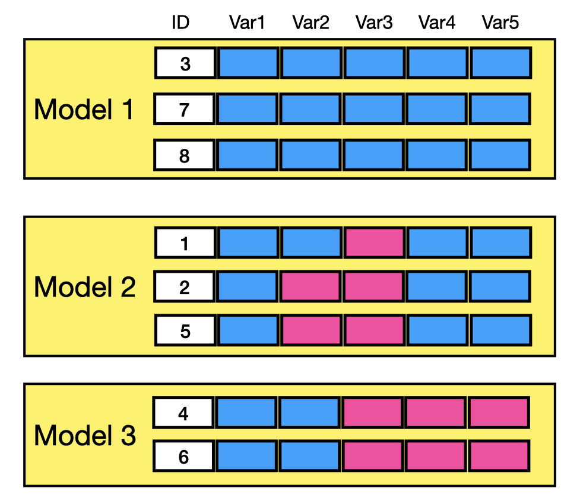

```{r setup, include = FALSE}
knitr::opts_chunk$set(
  collapse = TRUE,
  comment = "#>"
)
library(medley)
library(ComplexHeatmap)
library(mice)
library(randomForest)

data(daacs, package = 'medley')
null_accuracy <- mean(daacs$retained)
```

# Introduction

Most predictive modeling strategies require complete data to train and predict outcomes. A common strategy is to impute the missing data before training the models. However, in many situations, missing data occurs systematically which violates the missing completely at random (MCAR) assumption. For instance, data may be collected over multiple time periods or the available data may vary depending on varying collection protocols or selection bias at the individual level. The `medley` package provides a framework for estimating predictive model that takes into account the patterns of missing data.

The motivating example for this approach predictive modeling comes from predicting student success in college. Institutions have become increasingly interested in using predictive models to identify students at risk for attrition as early as possible in order to provided targeted interventions and supports. Information about students is collected over several months beginning at the college application phase, commitment to enroll, orientation, and finally behavior data as the student begins coursework. In addition to missing data being related to where the student is in the process, students may opt to not provide certain data elements. This results in a complex system where a single predictive model is appropriate.

# Strategy for Predictive Modeling with Missing Data

Consider a data frame with eight observations of five variables as represented in Figure \@ref(fig:framework-data). Rows 3, 7, and 8 have no missing data; row 1 is missing a value for variable 3; rows 2 and 5 are missing values in variables 2 and 3; and rows 4 and 6 are missing values in variables 3, 4, and 5.

```{r framework-data, echo=FALSE, fig.cap='Sample data frame with missing data.', out.width='90%'}
knitr::include_graphics('medley_data.png')
```

The first step of the `medley` algorithm is to determine the pattern of missingness. If we convert the data frame to a shadow matrix where zero indicates a missing value and one indicates the value is observed, we can compute the distribution of the number of observations for each combination of observed and missing values. Figure \@ref(fig:framework-upset) is an upset plot [@ComplexHeatmap] where the dots indicate that the corresponding variable was observed and the bars the size of that set. In this example, there are three observations where there is no missingness; one row where variable 3 is missing; two observations where variables 2 and 3 are missing; and two observations where variables 3, 4, and 5 are missing.

```{r framework-upset, echo=FALSE, fig.cap='Upset plot representing the pattern of missingness.', out.widht='90%'}
knitr::include_graphics('medley_upset.png')
```

Since we need at least two observations to train a predictive model, the maximum number of models we can train is three, as represented in Figure \@ref(fig:framework-models). Note that for observation 1 which was missing variable 3 is included in the model 2 since that is the next model that includes the most variables. One of the important parameters to the `medley` algorithm is the minimum sample size for a model to be considered. The default is 10% of the total sample size, however for very large data sets it may be more appropriate to set this parameter to a specific *n*.

```{r framework-models, echo=FALSE, fig.cap='Data frame organized by predictive model.', out.width = '90%'}

```

The order of models is important for both training and predicting since observations will be assigned to a model with the most number of variables observed. For example, when making a prediction for an observation where variable 2 is missing, model 2 would be used. For an observation that is missing variable 5, model 3 would be used since that is the only model trained without variable 5 as a dependent variable. 


# Data Source

The Diagnostic Assessment and Achievement of College Skills (DAACS; https://daacs.net). DAACS is a suite of technological and social supports designed to optimize student learning. Students complete assessments in self-regulated learning, writing, mathematics, and reading and upon completion receive immediate feedback in terms of developing, emerging, and mastering. The feedback is tailored to their results. The data for this paper was part of a larger randomized control trial where DAACS was embedded within orientation for the treatment students. Although students were instructed that orientation was required, there were no consequences for not completing orientation and therefore approximately `r round(mean(is.na(daacs$srl)) * 100)`% of students did not attempt orientation, and therefore did not complete any DAACS assessments. One of the primary research goals of the original study was whether the addition of DAACS data would increase the accuracy of prediction term-to-term retention (the `retained` variable). Table \@ref(tab:descriptives) for descriptive statistics which reveals that the DAACS results are not complete for some students. The overall retention base rate is `r round(null_accuracy * 100, digits = 2)`%.

```{r descriptives, echo=FALSE, warning=FALSE, message=FALSE, results='kable'}
# vtable::sumtable(daacs, title = 'Summary Statistics')
vtable::sumtable(daacs, title = 'Descriptive Statistics',
                 # caption = 'Descriptive Statistics',
                 out = 'kable',
                 summ = c('N(x)', 'mean(x)', 'sd(x)', 'median(x)'),
                 summ.names = c('N', 'Mean', 'Std Dev', 'Median'))
```

## Missing Data Patterns

To begin we first explore the patterns of missing data. Figure \@ref(fig:upset) is an UpSet plot [@ComplexHeatmap] created from a shadow matrix^[A shadow matrix has the same dimensions of the original data but the values correspond to whether the observation is missing (`FALSE`) or not (`TRUE`).]. Each vertical line corresponds to a set, or combination, of variables. The dots indicate that that variable is included in the set. The bars on the top correspond to the number of observations in that set and the bars to the right correspond to the total number of observed values. The largest set includes only the demographics variables, the second largest included demographics and all DAACS variables. There is a third set that includes self-regulated learning along with demographics that is worth considering since it contains more than 10% of the observations. It should be noted that there is a potential fourth set which included demographic variables along with three of DAACS variables (SRL, reading, and math). However, since this set has fewer than 10% of the observations we will use a three set/model solution. 

```{r upset, fig.cap='UpSet plot of the missing data', eval=TRUE, fig.height=7, fig.width = 6.5}
shadow_matrix <- as.data.frame(!is.na(daacs))
ComplexHeatmap::make_comb_mat(shadow_matrix) |> ComplexHeatmap::UpSet(right_annotation = NULL)
```

## Data Preparation

To perform the predictive modeling we will split the data into training (70%) and validation (30%) data sets.

```{r split-dataset}
set.seed(2112); train_rows <- sample(nrow(daacs), nrow(daacs) * 0.7)
daacs_train <- daacs[train_rows,]
daacs_valid <- daacs[-train_rows,]
```

# Baseline Models

There are generally two choices when estimating models when there is missing data: 1) Model using only the available data or 2) Impute the missing data before modeling. 

## Using available data

In the DAACS data set as depicted in Figure \@ref(fig:upset) the demographics variables were observed for all students. To start we train a logistic regression model on the training data.

```{r demographics-model-medley, include=FALSE, eval=FALSE}
# lr_medley_base_out <- medley(data = daacs_train,
#                                    formula = retained ~ income + employment + ell + ed_mother + ed_father + ethnicity + gender + military + age,
#                                    family = binomial(link = 'logit') )
```

```{r demographics-model}
lr_out <- glm(data = daacs_train,
              formula = retained ~ income + employment + ell + ed_mother + ed_father +
                ethnicity + gender + military + age,
              family = binomial(link = 'logit'))
rf_out <- randomForest(formula = factor(retained) ~ income + employment + ell + ed_mother + ed_father +
                         ethnicity + gender + military + age,
                       data = daacs_train)
```

We can get predicted values from the validation data set and print the confusion matrix.

```{r demographics-model-predictions}
lr_predictions <- predict(lr_out, newdata = daacs_valid, type = 'response')
confusion_matrix(observed = daacs_valid$retained,
                 predicted = lr_predictions > 0.5)

rf_predictions <- predict(rf_out, newdata = daacs_valid, type = 'response')
confusion_matrix(observed = daacs_valid$retained,
                 predicted = rf_predictions)
```

The overall accuracy using only the demographic variables is `r round(100 * accuracy(daacs_valid$retained, lr_predictions > 0.5), digits = 2)`%

Note that for random forests we used `type = 'response'` which provides the predicted class. If you wish to get predicted probabilities instead use `type = 'prob'` (also random forest returns a two column of predicted values, column 2 corresponds to the predicted probability of the "success" class). This is useful if you wish to plot a receiver operating characteristic (ROC) curve as shown in the figure below.

```{r, fig.width=7.5, fig.height=3, out.width='90%', fig.align='center'}
calculate_roc(
	predictions = predict(rf_out, newdata = daacs_valid, type = 'prob')[,2],
	observed = daacs_valid$retained
) |> plot()
```


## Mean Imputation

```{r}
daacs_complete_mean <- daacs
for(i in 2:ncol(daacs_complete_mean)) {
	missing_rows <- is.na(daacs_complete_mean[,i])
	if(sum(missing_rows) > 0) {
		daacs_complete_mean[missing_rows, i] <- mean(daacs_complete_mean[,i], na.rm = TRUE)
	}
}
```

```{r}
daacs_train_complete_mean <- daacs_complete_mean[train_rows,]
daacs_valid_complete_mean <- daacs_complete_mean[-train_rows,]

mean_lr_out <- glm(formula = retained ~ .,
                   data = daacs_train_complete_mean,
                   family = binomial(link = logit))
mean_lr_predictions <- predict(mean_lr_out, newdata = daacs_valid_complete_mean, type = 'response')
confusion_matrix(observed = daacs_valid_complete_mean$retained,
                 predicted = mean_lr_predictions > 0.5)

mean_rf_out <- randomForest(formula = factor(retained) ~ .,
                            data = daacs_train_complete_mean)
mean_rf_predictions <- predict(mean_rf_out, newdata = daacs_valid_complete_mean, type = 'response')
confusion_matrix(observed = daacs_valid_complete_mean$retained,
                 predicted = mean_rf_predictions)
```

```{r, include=FALSE}

```

## Multiple imputation

Another common approach to modeling with missing data is multiple imputation. The `mice` package (Multivariate Imputations by Chained Equations) is a robust and popular approach to imputing missing data. For simplicity we will use the final imputed data set for comparison^[There are multiple approaches suggested for getting predicted values from models trained using imputed data sets. For a more detailed explenation see this Github issue: https://github.com/amices/mice/issues/82].

```{r mice-impute, message = FALSE}
mice_out <- mice::mice(daacs[,-1], M = 5, seed = 2112, printFlag = FALSE)
daacs_complete_mice <- cbind(retained = daacs$retained, mice::complete(mice_out))

daacs_train_complete_mice <- daacs_complete_mice[train_rows,]
daacs_valid_complete_mice <- daacs_complete_mice[-train_rows,]
```

With the missing DAACS data imputed we can train a logistic regression model using the full data set.

```{r mice-model}
mice_lr_out <- glm(formula = retained ~ .,
                   data = daacs_train_complete_mice,
                   family = binomial(link = logit))
mice_lr_predictions <- predict(mice_lr_out, newdata = daacs_valid_complete_mice, type = 'response')
confusion_matrix(observed = daacs_valid_complete_mice$retained,
                 predicted = mice_lr_predictions > 0.5)

mice_rf_out <- randomForest(formula = factor(retained) ~ .,
                            data = daacs_train_complete_mice)
mice_rf_predictions <- predict(mice_rf_out, newdata = daacs_valid_complete_mice, type = 'response')
confusion_matrix(observed = daacs_valid_complete_mice$retained,
                 predicted = mice_rf_predictions)

```

The overall accuracy using only imputed data set is `r round(100 * accuracy(daacs_valid_complete_mice$retained, mice_lr_predictions > 0.5), digits = 2)`%

```{r model-with-shadow-matrix, include=FALSE, eval=FALSE}
# TODO: Decide whether this should be included in the paper. The accuracy of using
# the shadow matrix in the predictive model is nearly the same as the medley
# approach. However, in practice, making predictions on new data would require
# imputing the missing values which is not trivial.
names(shadow_matrix) <- paste0(names(shadow_matrix), '_miss')
shadow_matrix <- shadow_matrix[,!apply(shadow_matrix, 2, all)]
daacs_train_complete_mice <- cbind(daacs_train_complete_mice, shadow_matrix[train_rows,])
daacs_valid_complete_mice <- cbind(daacs_valid_complete_mice, shadow_matrix[-train_rows,])
mice_lr_out2 <- glm(formula = retained ~ .,
                   data = daacs_train_complete_mice,
                   family = binomial(link = logit))
summary(mice_lr_out2)
mice_lr_predictions2 <- predict(mice_lr_out2, newdata = daacs_valid_complete_mice, type = 'response')
confusion_matrix(observed = daacs_valid_complete_mice$retained,
                 predicted = mice_lr_predictions2 > 0.5)
```


# Medley models

The `medley` function implements a step wise approach to training models. The `data` and `formula` parameters specify the data set and full model (i.e. all possible predictor variables to be considered), similar to other modeling functions in R. The `method` parameter indicates what model procedure should be used. In this example we will estimate logistic regression models. The `medley` can take any additional parameters that need to be passed to the `method` function.

```{r medley-train-lr}
medley_lr_out <- medley(data = daacs_train,
                              formula = retained ~ .,
                              method = glm,
                              family = binomial(link = logit))
```

```{r model-summaries-setup, echo=FALSE, results='hide'}
model_sum <- summary(medley_lr_out)
medley_lr_predictions <- predict(medley_lr_out,
                                 newdata = daacs_valid,
                                 type = 'response')
# model_sum$Accuracy <- NA
# for(i in seq_len(medley_lr_out$n_models)) {
#   model_sum[i,]$Accuracy <- accuracy(daacs_train[medley_lr_out$model_observations[,i],]$retained,
#                                      medley_lr_predictions[medley_lr_out$model_observations[,i]] > 0.5) * 100
# }
# model_sum <- model_sum[,c('Model', 'n', 'Success', 'Accuracy', 'Formula')]
```

Table \@ref(tab:model-summaries) provides the baseline retention rate by model along with the number of observations and formula for each of the models. Before exploring the specific of the modeling this reveals that the pattern of missing data is predictive of success. Students who complete all four DAACS assessments are `r round(model_sum[1,]$Retained - model_sum[nrow(model_sum),]$Retained, digits = 1)`% more likely to be retained then students who did not complete any of the assessments.

```{r model-summaries, echo=FALSE, results='asis'}
knitr::kable(model_sum, 
             row.names = FALSE,
             digits = 2, 
             caption = "Baseline retention rate by model")
```

The object returned by `medley` contains the following elements:

* `n_models` - The number of models estimated.
* `formulas` - A list of the formulas used for each model. 
* `models` - A list containing the model output for each model. In this example this would contain the results of the `glm` function call.
* `data` - The full data set used to train the models.
* `model_observations` - A data frame indicating which models each observation was used in. The rows correspond to the rows in `data` and the columns correspond to the model.

By default the algorithm will use all sets that have at least 10% of the total observations (see \@ref(tab:model-summaries)). This can be adjusted using the `min_set_size` parameter (see the `get_variable_sets()` function). Optionally you can specify the models directly by passing a list of formulas with the `var_sets` parameter.

Table \@ref(tab:modelresults) provides the model summaries for the `r medley_lr_out$n_models` models estimated.

```{r modelresults, echo=FALSE, warning=FALSE}
reg_tab <- huxtable::huxreg(medley_lr_out$models, error_pos = 'right')
huxtable::set_caption(reg_tab, 'Logistic regression results')
```

The S3 generic function `predict` has been implemented. Specifying the `newdata` parameter will give predictions for the validation data set.

```{r medley-predictions-lr}
medley_lr_predictions <- predict(medley_lr_out,
                                 newdata = daacs_valid,
                                 type = 'response')
```

The confusion matrix is provided below. The overall accuracy for the medley model is `r round(accuracy(lr_predictions > 0.5, daacs_valid$retained) * 100, digits = 3)`% which is a `r round(100 * (accuracy(lr_predictions > 0.5, daacs_valid$retained) - mean(daacs_valid$retained)), digits = 2)`% over the baseline, or *null*, model.

```{r roc, fig.width=8.5, fig.height=3, include=FALSE}
calculate_roc(medley_lr_predictions,
              daacs_valid$retained) |> plot()
```

```{r medley-confusion-matrix-lr}
confusion_matrix(observed = daacs_valid$retained,
                 predicted = medley_lr_predictions > 0.5)
```

## Random Forests

The core functionality of the `medley` algorithm is to select the most appropriate model given the available data. The specific predictive model is up to the user. Fernandez-Delgado et al (2014) evaluated the performance of 179 classifiers across 121 data sets. Their results showed that, in general, random forest was the best performing model. To begin, we load the `randomForest` pacakge and convert our dependent variable to a factor to ensure a classification (versus regression) model is estimated.

```{r random-forest-setup, message=FALSE}
daacs_train$retained <- as.factor(daacs_train$retained)
daacs_valid$retained <- as.factor(daacs_valid$retained)
```

Training and predicting are the same as above except we set `method = randomForest`.

```{r medley-random-forest}
medley_rf_out <- medley(data = daacs_train,
                              formula = retained ~ .,
                              method = randomForest)
medley_rf_predictions <- predict(medley_rf_out, 
                                 newdata = daacs_valid,
                                 type = "response") == 2
```

Lastly, the confusion matrix gives the overall accuracy. In this example though we see the random forest performs sligthly worse than logistic regression.

```{r medley-confusion-matrix-rf}
confusion_matrix(observed = daacs_valid$retained,
                 predicted = medley_rf_predictions )
```

## Using observations in multiple models

The default behavior of the `medley` algorithm is for each observation to be used in only one model. However, in this particular example, we have complete demographic data for all students so we could potentially use all observations to train that model. The `exclusive_membership` parameter will allow observations to be used in training models for which there is complete data. 

```{r medley-exclusive-membership}
medley_rf_out2 <- medley(data = daacs_train,
                              formula = retained ~ .,
                              exclusive_membership = FALSE,
                              method = randomForest)
medley_rf_predictions2 <- predict(medley_rf_out2, 
                          newdata = daacs_valid,
                          type = "response")
confusion_matrix(observed = daacs_valid$retained,
                 predicted = medley_rf_predictions2 )

```

As the results above show we get a very modest increase in the overall accuracy. It should be noted that predictions are estimated from the model that uses most variables for each observation.

# Discussion

```{r summary-table-setup, echo=FALSE, results='kable'}
overall <- data.frame(
  Method = c(
    'Observed data only logistic regression',
    'Observed data only random forest',
    'Mean imputed data set with logistic regression',
    'Mean imputed data set with random forest',
    'Mice imputed data set logistic regression',
    'Mice imputed data set random forest',
    'Medley with logistic regression',
    'Medley with random forest'
  ),
  Accuracy = c(
    100 * accuracy(daacs_valid$retained, lr_predictions > 0.5),
    100 * accuracy(daacs_valid$retained, rf_predictions),
    100 * accuracy(daacs_valid_complete_mean$retained, mean_lr_predictions > 0.5),
    100 * accuracy(daacs_valid_complete_mean$retained, mean_rf_predictions),
    100 * accuracy(daacs_valid_complete_mice$retained, mice_lr_predictions > 0.5),
    100 * accuracy(daacs_valid_complete_mice$retained, mice_rf_predictions),
    100 * accuracy(daacs_valid$retained, medley_lr_predictions > 0.5),
    100 * accuracy(daacs_valid$retained, medley_rf_predictions)
  )
)
overall$Improvement <- overall$Accuracy - (100 * null_accuracy)
knitr::kable(overall, 
             row.names = FALSE,
             digits = 2, 
             caption = "Model performance summary") |>
  kableExtra::add_footnote(
    paste0('Improvement is the difference with the overall retention rate of ', 
           round(100*null_accuracy, digits = 3), '%.'),
    notation = 'none')
```

```{r, echo=FALSE, prompt=FALSE, comment=''}
options(width = 120)
combine_confusion_matrices(
  `Observed data only logistic regression` = confusion_matrix(daacs_valid$retained, lr_predictions > 0.5),
  `Observed data only random forest` = confusion_matrix(daacs_valid$retained, rf_predictions),
  `Imputed data set logistic regression` = confusion_matrix(daacs_valid_complete_mice$retained, mice_lr_predictions > 0.5),
  `Imputed data set random forest` = confusion_matrix(daacs_valid_complete_mice$retained, mice_rf_predictions),
  `Medley with logistic regression` = confusion_matrix(daacs_valid$retained, medley_lr_predictions > 0.5), 
  `Medley with random forest` = confusion_matrix(daacs_valid$retained, medley_rf_predictions)
) |>  print(row.names = FALSE)

# combine_confusion_matrices(
#   confusion_matrix(daacs_valid$retained, lr_predictions > 0.5),
#   confusion_matrix(daacs_valid$retained, rf_predictions),
#   confusion_matrix(daacs_valid_complete_mice$retained, mice_lr_predictions > 0.5),
#   confusion_matrix(daacs_valid_complete_mice$retained, mice_rf_predictions),
#   confusion_matrix(daacs_valid$retained, medley_lr_predictions > 0.5), 
#   confusion_matrix(daacs_valid$retained, medley_rf_predictions == 2)
# ) |>  print(row.names = FALSE)

```
